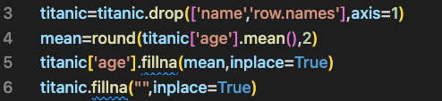

# Introduction
This was cross-validated using the Titanic dataset.

# Description
In this case, we used the famous Titanic dataset for machine learning.
Delete "Name" and "row.name"
Mean values are assigned to missing age locations.

The number of trees is 493 and cross-validation is performed 10 times.
Assign "survived" to the objective variable y, and assign other values to the explanatory variable X.
We use a random forest for training.
Finally, we output the prediction score, the mean score, and the standard deviation score

