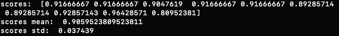

# Introduction
This was cross-validated using the Titanic dataset.

# Description
In this case, we used the famous Titanic dataset for machine learning.
Delete "Name" and "row.name"
Mean values are assigned to missing age locations.
```
titanic=titanic.drop(['name','row.names'],axis=1)
mean=round(titanic['age'].mean(),2)
titanic['age'].fillna(mean,inplace=True)
titanic.fillna("",inplace=True)
```

Peep the age data from the titanic data set and convert the other data to numbers with label encoding.
```
from sklearn.preprocessing import LabelEncoder
le = LabelEncoder()
for i in titanic.columns.values.tolist():
 if (i=='age'):
  pass
 else:
  titanic[i] = le.fit_transform(titanic[i])
```

The number of trees is 493 and cross-validation is performed 10 times.
Assign "survived" to the objective variable y, and assign other values to the explanatory variable X.
```
trees=493
crossv=10
X = titanic.drop(["survived"], axis=1)
y = titanic["survived"]
```

The machine learning algorithm uses a random forest.
The test size is set to 0.1.
Finally, cross-validation is used to produce a score.
```
from sklearn.ensemble import RandomForestClassifier
from sklearn.model_selection import cross_val_score
from sklearn.metrics import *
from sklearn.model_selection import ShuffleSplit
cv = ShuffleSplit(n_splits=crossv, test_size=0.1, random_state=10)
clf = RandomForestClassifier(criterion="entropy", n_estimators=trees, max_depth=None, min_samples_split=2, random_state=10, n_jobs=-1)
scores = cross_val_score(clf, X, y, cv=cv)
```
# 

# Postscript
In this case, we wrote the program using the titanic dataset, which is often used as an introduction to machine learning studies.<br>
We used random forests as our method this time, but we will try other machine learning algorithms in the future and update the program accordingly.<br>
Izuru Inose